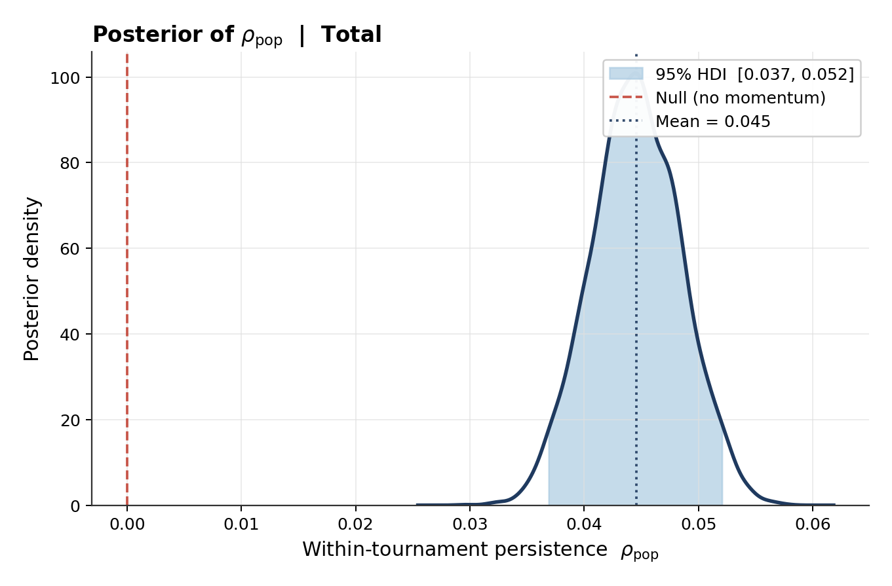
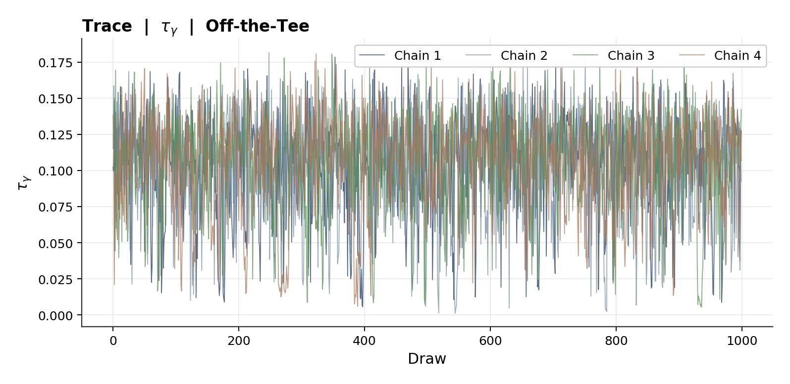
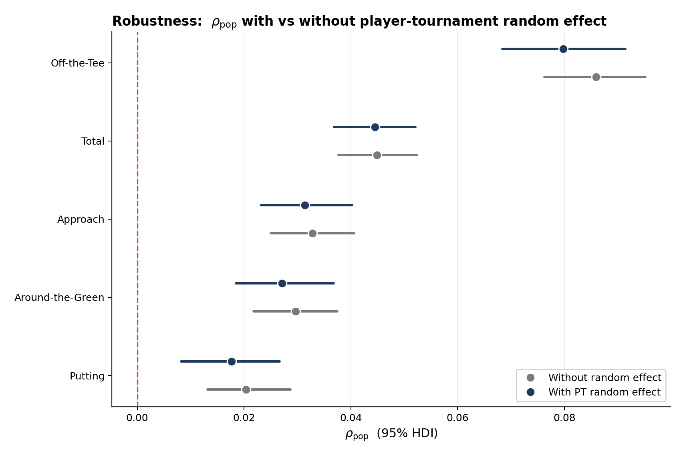

# Is Golf a Momentum Sport?

**A Bayesian test of whether a good round predicts the next one, within the same tournament.**

Jake Kostoryz · Isaiah Nick

---

Golf commentary runs on momentum. A player "finds his rhythm," "rides the wave," gets
"hot." Whether that language describes anything real, once you account for how good the
player already is and how the course played that day, is an open question. This project
answers it for the narrowest, cleanest case: **do consecutive rounds within a single
tournament actually persist?**

The motivation is practical. The larger goal is a live, in-tournament model that updates
a player's win probability as rounds come in. That model only needs round-to-round
momentum in its structure if the momentum is real. So we tested for it first.

## The result in one picture

Momentum exists, it is small, and it **decays toward the hole**. Driving is the most persistent part of the game round-to-round; putting is the least. 
The skill most invoked in broadcast momentum talk is the one with the weakest evidence behind it.

| Component | Persistence (ρ) | Verdict |
|---|---|---|
| Off-the-Tee | 0.080 | Strongest |
| Total | 0.045 | |
| Approach | 0.031 | |
| Around-the-Green | 0.027 | |
| Putting | 0.018 | Weakest |

A persistence of 0.08 means about 8% of a good (or bad) round off-the-tee carries into
the next. Real, but modest against the round-to-round noise.

## How we got there

**Strip out what isn't momentum.** Raw strokes gained is measured against each round's
field, so it mixes a player's own performance with how strong that week's field was and
how the course played. Before testing anything, we removed both: a walk-forward ridge
regression estimates each player's skill as of the Monday before the event and each
round's difficulty, and we work with what's left over. That residual is performance with
skill and conditions already subtracted, which is the only thing momentum could live in.

**Set up a fair fight.** Two models, one per strokes-gained component. The null says each
round is an independent draw. The alternative says each round is a partial echo of the
one before, through a persistence parameter that is partially pooled across players. We
let the data pick the winner via out-of-sample fit (PSIS-LOO).

**Kill the obvious objection.** A first pass found momentum everywhere, but any effect
that sits at the tournament level (the course suiting a player, a good weather draw, a
stale skill estimate) shifts all four of their rounds together, and the model would read
that shared shift as momentum. We added a per-player-per-tournament control to absorb it.

**Fix the model that broke.** Adding that control directly meant sampling 33,000+ latent
values, which collapsed the sampler into a funnel: chains stalling, divergences, a useless
posterior. The fix was to integrate those values out analytically, since a sum of
Gaussians is still Gaussian, they fold cleanly into the likelihood's covariance. Same
model, same control, but now it converges in a few minutes with no pathologies.

**Confirm it survives.** With the control in, persistence dropped by at most 10% and the
ordering held. A posterior predictive check reproduced the observed lag-1 correlation
(0.081 observed, 0.079 simulated), and the result was unchanged across a range of priors.
The momentum is not an artifact of course fit or field strength.

## Where this goes next

The verdict is that a Markov structure is justified: the live win-probability model
should carry round-to-round persistence rather than treating rounds as independent.

Two known limitations point the way forward. The player-skill and round-difficulty inputs
are currently point estimates, so their uncertainty does not flow into the final result;
propagating it fully would tighten the honesty of the intervals. And the Gaussian
likelihood understates the tails, real golf produces about three times as many blow-up
rounds as it expects, so a heavier-tailed (Student-t) likelihood is the natural next step.
Neither changes the momentum estimate, but both matter for a model that has to price
extreme outcomes.

## Repo contents

| File | Role |
|---|---|
| `adjusted_sg.py` | Ridge regression for player skill and round difficulty |
| `build_residuals.py` | Builds the residual dataset the momentum test runs on |
| `momentum_pymc.py` | Independence vs AR(1), first pass |
| `momentum_pymc_re.py` | Same test with the marginalized tournament control (headline result) |
| `momentum_pymc_explicit_gamma.py` | The unmarginalized version, kept to document the funnel |
| `ppc.py` | Posterior predictive check |
| `prior_sensitivity.py` | Robustness of the result to prior choices |
| `plot_diagnostics.py` | All figures |

Data is from the DataGolf API (PGA Tour and LIV, 2019-2026, ~134K rounds). The source
database is not included.

**Full slide deck:** [`report/momentum_presentation.pdf`](report/momentum_presentation.pdf)